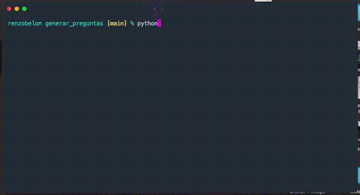

# Generador de preguntas con GPT

Usa la API de GPT para generar preguntas de opción múltiple, basándose en un temario. La idea es generar sets de preguntas para que sean utilizadas en una app de cuestionarios / quizes.

Actualmente envía fragmentos cortos del temario (separados manualmente) para que GPT genere el contenido.

Problemas:

- Las preguntas tienen calidad aceptable (se pueden mejorar), pero las opciones no. Tienden a ser muy deducibles.
- Al enviar fragmentos, a GPT le falta contexto, y muchas veces tiene que inventar más de la cuenta (a veces el fragmento podria estar hablando de un aeropuerto, por ejemplo).

TODO:
- Mejorar prompts para obtener mejores preguntas y opciones. Quizá dar ejemplos de estilo, redacción, etc.
- Acompañar los prompts con contexto suficiente para que GPT no tenga que adivinar demasiado. Ej. resumen de cada capítulo, etc.
- Automatizar la separación del material original en fragmentos adecuados para enviar a GPT.
- ¡Limpieza y orden general! Funciones puras. logs, tests, etc.

## Demo

